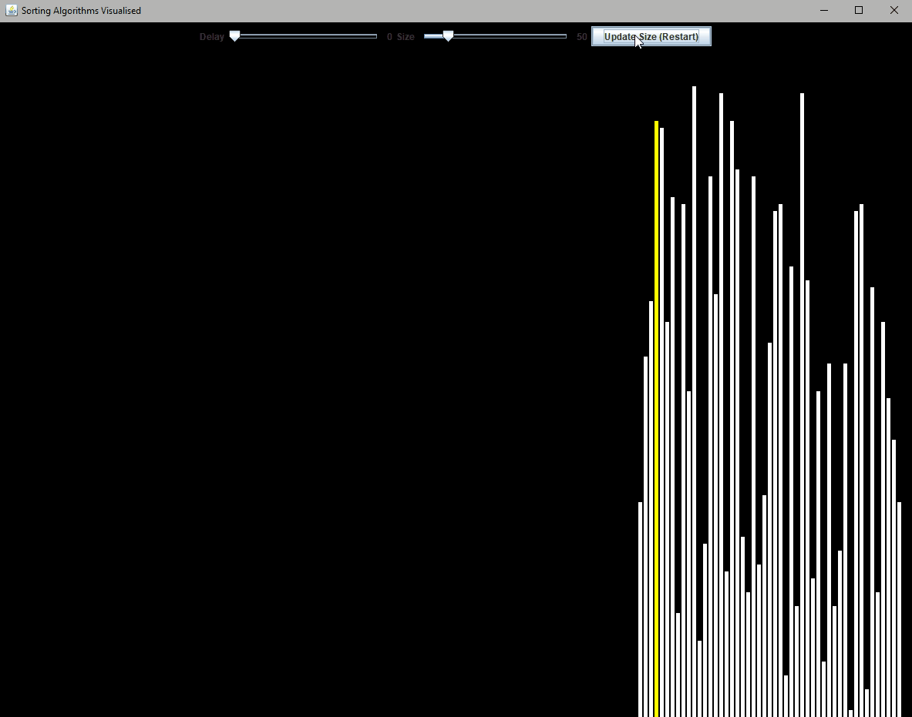
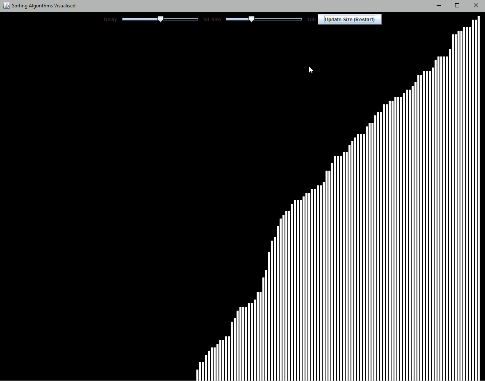

# Sorting-Algorithms-Visualised
Small program showing the visual representation of an int array from smallest to largest via use of multiple common sorting algorithms

### Current Algorithms
#### Insertion Sort
 

  

#### Bubble Sort
 

  

 #### Quick Sort (Soon)
